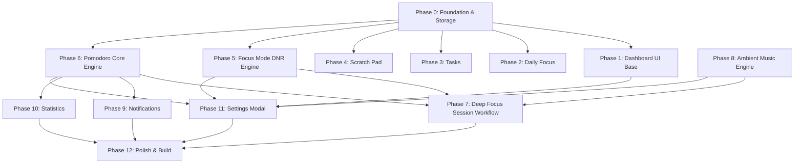

# Focus Dashboard — Phase & Task Breakdown (`tasks.md`)

This document outlines the atomic, phased implementation tasks for building the **Focus Dashboard** Chrome Extension (Manifest V3) based on [Focus_Dashboard_PRD_v1.1_Deep_Focus.md](file:///c:/Users/saisr/OneDrive/Documents/Projects%20AI/Focus%20Dashboard/Focus_Dashboard_PRD_v1.1_Deep_Focus.md).

---

## Technical Dependencies & Architecture Overview

---

## Phase 0: Project Foundation & Storage Schema

Dependencies: None

- [x] **Task 0.1: Extension Manifest V3 & File Structure Initialization**
  - **Description**: Create extension layout and `manifest.json` configured for Chrome New Tab replacement.
  - **Target Files**: `manifest.json`, `index.html`, `background.js`
  - **Acceptance Criteria**:
    - `chrome.tabs` / `chrome.declarativeNetRequest` / `storage` / `alarms` / `notifications` permissions configured.
    - `chrome_url_overrides.newtab` set to `index.html`.
    - Extension loads cleanly in developer mode (`chrome://extensions`) without warnings.

- [x] **Task 0.2: Central Storage Service Module (`chrome.storage.local`)**
  - **Description**: Implement a robust typed storage service with default fallback state for all extension modules.
  - **Target Files**: `src/services/storage.js`
  - **Acceptance Criteria**:
    - Exports async getters/setters for `userName`, `wallpaper`, `dailyFocus`, `tasks`, `scratchPad`, `pomodoroState`, `focusModeState`, `ambientAudioState`, `stats`, and `settings`.
    - Handles default fallback values on clean install.
    - Provides reactive storage change listener (`chrome.storage.onChanged.addListener`).

- [x] **Task 0.3: Design System, CSS Variables & Typography Setup**
  - **Description**: Define modern glassmorphism design system, dark mode color palette, typography (Inter / Outfit via Google Fonts), and responsive flex/grid layouts.
  - **Target Files**: `styles/variables.css`, `styles/main.css`
  - **Acceptance Criteria**:
    - CSS custom properties defined for primary, background, surface, glass-blur, accent colors, and font families.
    - Typography rules, CSS reset, and custom scrollbars configured.

---

## Phase 1: Dashboard UI Base (PRD Phase 1)

Dependencies: Phase 0

- [x] **Task 1.1: Dashboard Layout Shell Structure**
  - **Description**: Build the main responsive HTML grid layout for header, center clock/focus zone, side panel (tasks/scratchpad), and bottom control bar.
  - **Target Files**: `index.html`, `styles/layout.css`
  - **Acceptance Criteria**:
    - Full viewport canvas (`100vw` x `100vh`) with fixed backdrop and transparent card containers.
    - Responsive layout adapts smoothly down to `768px` screens.

- [x] **Task 1.2: Dynamic & Custom Wallpaper Engine**
  - **Description**: Build background wallpaper renderer supporting curated default background images and local user uploaded images.
  - **Target Files**: `src/components/wallpaper.js`, `styles/wallpaper.css`
  - **Acceptance Criteria**:
    - Displays high-resolution default background imagery on initial launch.
    - Supports custom image file upload (`FileReader` converting to base64 or storage blob).
    - Smooth fade-in overlay to ensure high contrast for text readability.

- [x] **Task 1.3: Live Clock & Date Display**
  - **Description**: Implement digital clock updating every second with formatted day and date.
  - **Target Files**: `src/components/clock.js`
  - **Acceptance Criteria**:
    - Displays current time (HH:MM:SS or HH:MM) supporting 12h/24h setting formats.
    - Displays localized date (e.g., "Monday, October 24").
    - Updates dynamically using `requestAnimationFrame` or `setInterval` tick without CPU memory leaks.

- [x] **Task 1.4: Dynamic Time-based Greeting Component**
  - **Description**: Render greeting message reflecting time of day (Morning/Afternoon/Evening) and user's saved name.
  - **Target Files**: `src/components/greeting.js`
  - **Acceptance Criteria**:
    - Calculates greeting string based on current hour (`< 12` morning, `< 17` afternoon, else evening).
    - Integrates saved `userName` from storage service (defaults to "Friend" if unset).
    - Updates in real-time if name is changed in Settings.

---

## Phase 2: Daily Focus (PRD Phase 2)

Dependencies: Phase 0, Phase 1

- [x] **Task 2.1: Daily Focus Storage & Auto-Reset Logic**
  - **Description**: Implement logic to store the main daily focus item with a date stamp, auto-clearing when a new calendar day starts.
  - **Target Files**: `src/services/dailyFocusService.js`
  - **Acceptance Criteria**:
    - Daily focus data model includes `text`, `dateStamp` (`YYYY-MM-DD`), and `isCompleted`.
    - Check on dashboard open: if `dateStamp !== today`, reset focus input to prompt state.

- [x] **Task 2.2: Daily Focus UI Component**
  - **Description**: Render interactive daily focus prompt asking "What is your main focus today?" switching to editable focus view once set.
  - **Target Files**: `src/components/dailyFocus.js`, `styles/dailyFocus.css`
  - **Acceptance Criteria**:
    - Unset state: Centered sleek input box with submission action on Enter.
    - Set state: Displays focus text with completion checkbox and inline edit button.
    - Persists changes instantly to storage.

---

## Phase 3: Tasks List (PRD Phase 3)

Dependencies: Phase 0, Phase 1

- [x] **Task 3.1: Task Management Data Service**
  - **Description**: Implement CRUD operations for task item array stored in `chrome.storage.local`.
  - **Target Files**: `src/services/taskService.js`
  - **Acceptance Criteria**:
    - Functions: `getTasks()`, `addTask(text)`, `toggleTask(id)`, `deleteTask(id)`.
    - Sorting algorithm: Active tasks ordered by creation, completed tasks automatically sorted to bottom.

- [x] **Task 3.2: Task List Widget UI Component**
  - **Description**: Build glassmorphism task card with task creation input, task list items, checkbox completion, and delete action.
  - **Target Files**: `src/components/taskList.js`, `styles/taskList.css`
  - **Acceptance Criteria**:
    - Seamlessly add new task on input submit.
    - Checking a task animates strike-through styling and shifts task to completed section.
    - Deleting a task removes it from DOM and storage.
    - Scrollable task list container when content exceeds card height.

---

## Phase 4: Scratch Pad (PRD Phase 4)

Dependencies: Phase 0, Phase 1

- [x] **Task 4.1: Scratch Pad UI & Auto-Save Service**
  - **Description**: Create lightweight plain text scratch pad note component with debounced auto-save.
  - **Target Files**: `src/components/scratchPad.js`, `styles/scratchPad.css`
  - **Acceptance Criteria**:
    - Plain text `<textarea>` element with custom focus styling.
    - Auto-saves content to `chrome.storage.local` after 300ms of inactivity (debounced).
    - Restores existing text content on dashboard load.

---

## Phase 5: Focus Mode & Website Blocking (PRD Phase 5)

Dependencies: Phase 0

- [x] **Task 5.1: Declarative Net Request (DNR) Blocklist Manager**
  - **Description**: Implement service worker DNR rule builder to dynamically redirect blocked domains to `blocked.html`.
  - **Target Files**: `src/services/blocklistService.js`, `background.js`
  - **Acceptance Criteria**:
    - Default blocked domains: `youtube.com`, `instagram.com`, `linkedin.com`, `reddit.com`, `facebook.com`, `x.com`.
    - Uses `chrome.declarativeNetRequest.updateDynamicRules` to enable/disable redirect rules dynamically.
    - Redirect target: extension's internal `blocked.html` page.

- [x] **Task 5.2: Blocked Landing Page (`blocked.html`) Component**
  - **Description**: Create distracting website replacement page showing user's current focus, active timer, and controls.
  - **Target Files**: `blocked.html`, `src/pages/blocked.js`, `styles/blocked.css`
  - **Acceptance Criteria**:
    - Displays today's Daily Focus text clearly.
    - Displays remaining active Pomodoro session countdown.
    - "Return to Safety" button closes tab or redirects back.
    - "Disable Focus Mode" button turns off DNR rules and allows page load.

---

## Phase 6: Interactive Pomodoro Engine (PRD Phase 7)

Dependencies: Phase 0, Phase 1

- [x] **Task 6.1: Timestamp-Based Pomodoro State Machine Service**
  - **Description**: Build robust background-compatible timer engine utilizing absolute target timestamps (`endTime = Date.now() + duration`) instead of fragile background interval counters.
  - **Target Files**: `src/services/pomodoroEngine.js`
  - **Acceptance Criteria**:
    - Modes: `FOCUS` (25 min), `SHORT_BREAK` (5 min), `LONG_BREAK` (15 min).
    - Methods: `start()`, `pause()`, `resume()`, `skipBreak()`, `reset()`.
    - Accurately tracks remaining seconds across browser restarts and background service worker sleeping.

- [x] **Task 6.2: Service Worker Alarm Sync Integrator**
  - **Description**: Register `chrome.alarms` in background script to trigger completion events when background service worker is idle.
  - **Target Files**: `background.js`
  - **Acceptance Criteria**:
    - Schedules `chrome.alarms` match for target timer `endTime`.
    - Emits message bus event on alarm trigger to notify open extension tabs and trigger notification alerts.

- [x] **Task 6.3: Interactive Tomato Timer UI Component**
  - **Description**: Create interactive tomato visual timer beside the main clock.
  - **Target Files**: `src/components/pomodoroTomato.js`, `styles/pomodoroTomato.css`
  - **Acceptance Criteria**:
    - Tomato shape visual rotating smoothly like a physical kitchen timer according to session progress %.
    - Digital time overlay displaying `MM:SS`.
    - Interactive controls on hover/click: Start, Pause, Resume, Skip, Stop.

---

## Phase 7: Deep Focus Session Workflow (PRD Phase 6)

Dependencies: Phase 5, Phase 6, Phase 8

- [x] **Task 7.1: Deep Focus Orchestrator Service**
  - **Description**: Implement one-click workflow service that simultaneously triggers Pomodoro, Focus Mode blocking, ambient audio, and session logging.
  - **Target Files**: `src/services/deepFocusService.js`
  - **Acceptance Criteria**:
    - `startDeepFocus()` method:
      1. Starts Focus Pomodoro session.
      2. Activates DNR Focus Mode website blocking.
      3. Initiates ambient sound playback (if enabled in settings).
      4. Creates active session entry in storage for statistics.
    - `endDeepFocus()` gracefully halts all sub-services.

- [x] **Task 7.2: Deep Focus CTA Button UI Component**
  - **Description**: Render prominent "Start Deep Focus" action button with active session status indicators.
  - **Target Files**: `src/components/deepFocusButton.js`, `styles/deepFocusButton.css`
  - **Acceptance Criteria**:
    - Standard state: Vibrant glowing action button "⚡ Start Deep Focus".
    - Active state: Transforms into glowing status badge showing session duration and stop trigger.

---

## Phase 8: Ambient Music Engine (PRD Phase 8)

Dependencies: Phase 0, Phase 1

- [x] **Task 8.1: Audio Player Core Service & Offscreen Document**
  - **Description**: Create Web Audio sound player managing seamless looping ambient sound tracks (Rain, Forest, Brown Noise, White Noise, Ocean, Café, Fireplace, Piano, Lo-fi).
  - **Target Files**: `src/services/audioEngine.js`, `offscreen.html`, `offscreen.js`
  - **Acceptance Criteria**:
    - Plays audio tracks stored locally or packaged as assets.
    - Offscreen document integration ensures audio playback continues reliably when service worker suspends.
    - Controls: play track, pause, volume adjustment (`0.0` to `1.0`), smooth fade-in/fade-out transitions.

- [x] **Task 8.2: Ambient Sound Picker Widget UI**
  - **Description**: Build ambient sound selector widget with track selection list, master play/toggle button, and volume slider.
  - **Target Files**: `src/components/ambientSoundPicker.js`, `styles/ambientSoundPicker.css`
  - **Acceptance Criteria**:
    - Compact glass modal or drawer listing sound categories with icons.
    - Volume slider updates volume in real-time.
    - Auto-play toggle option syncs with Deep Focus launch settings.

---

## Phase 9: Notifications System (PRD Phase 9)

Dependencies: Phase 6

- [x] **Task 9.1: Chime & Extension Notification Manager**
  - **Description**: Implement notification trigger service for session completion events.
  - **Target Files**: `src/services/notificationService.js`
  - **Acceptance Criteria**:
    - Plays soft completion chime sound via Audio API.
    - Gradual volume fade-out of playing ambient music upon focus completion.
    - Triggers native Chrome notification via `chrome.notifications.create` ("Focus Session Complete! Take a break.").

- [x] **Task 9.2: Completion Modal Overlay UI**
  - **Description**: Display gentle completion overlay prompt when user returns to new tab after timer finishes.
  - **Target Files**: `src/components/completionModal.js`, `styles/completionModal.css`
  - **Acceptance Criteria**:
    - Micro-animation of tomato timer celebrate state.
    - Action buttons: "Start Break", "Skip Break", "Start Another Focus".

---

## Phase 10: Statistics Tracker (PRD Phase 10)

Dependencies: Phase 6, Phase 7

- [x] **Task 10.1: Focus Statistics Data Collector & Aggregator**
  - **Description**: Track, aggregate, and store daily and weekly focus metrics.
  - **Target Files**: `src/services/statsService.js`
  - **Acceptance Criteria**:
    - Logs session data: duration minutes, timestamp, completed status, blocked site attempt counter.
    - Calculates daily totals & weekly totals (focus hours, completed pomodoros, blocked attempts).
    - Retains lifetime cumulative focus metrics.

- [x] **Task 10.2: Statistics Dashboard Widget UI Component**
  - **Description**: Create visual analytics card displaying daily/weekly metrics and progress bars.
  - **Target Files**: `src/components/statsWidget.js`, `styles/statsWidget.css`
  - **Acceptance Criteria**:
    - Visual metrics display: Total focus hours today, Pomodoros completed, Distractions blocked.
    - Simple CSS bar chart for weekly focus trend.

---

## Phase 11: Settings & Customization Panel (PRD Phase 11)

Dependencies: Phase 0 through Phase 10

- [x] **Task 11.1: Settings Modal UI Component**
  - **Description**: Build full customization modal panel exposing configuration controls for all extension features.
  - **Target Files**: `src/components/settingsModal.js`, `styles/settingsModal.css`
  - **Acceptance Criteria**:
    - Tabbed configuration interface:
      - **General**: User Name, Wallpaper selection / upload.
      - **Pomodoro**: Custom durations (Focus, Short Break, Long Break).
      - **Focus Mode**: Block list URL manager (add/remove custom domain entries).
      - **Sound**: Notification sound selection, Auto-start ambient music toggle.
      - **Automations**: Auto-enable Focus Mode on session start toggle.

- [x] **Task 11.2: Settings Sync & Reset Engine**
  - **Description**: Implement settings application logic to update active services dynamically upon setting changes.
  - **Target Files**: `src/services/settingsService.js`
  - **Acceptance Criteria**:
    - Saves changes to `chrome.storage.local`.
    - Immediately re-configures Pomodoro engine defaults, DNR rules, and theme settings without needing page reload.
    - "Restore Default Settings" button safely resets configuration.

---

## Phase 12: Polish, Verification & Packaging

Dependencies: Phase 1 through Phase 11

- [x] **Task 12.1: Glassmorphic Aesthetic Polish & Micro-Animations**
  - **Description**: Fine-tune UI elements, glass backdrop blurs, transition animations, and hover states.
  - **Target Files**: `styles/animations.css`, `styles/main.css`
  - **Acceptance Criteria**:
    - Micro-animations for button presses, task checking, and modal openings.
    - Ensures clean rendering across high-DPI displays.

- [x] **Task 12.2: Offline Functionality & Storage Quota Audit**
  - **Description**: Verify extension functionality in completely offline environment and audit storage memory usage.
  - **Target Files**: Entire repository codebase
  - **Acceptance Criteria**:
    - All features (timer, audio files, storage, UI, block pages) work 100% offline without external network dependencies.
    - Storage data stays well within Chrome quota limits.

- [x] **Task 12.3: Production Build Packaging & Manifest Verification**
  - **Description**: Prepare distribution ready extension package.
  - **Target Files**: `dist/`, build script / zip
  - **Acceptance Criteria**:
    - Validated using Chrome Extension Developer Tools.
    - No console errors, memory leaks, or unhandled promise rejections.
